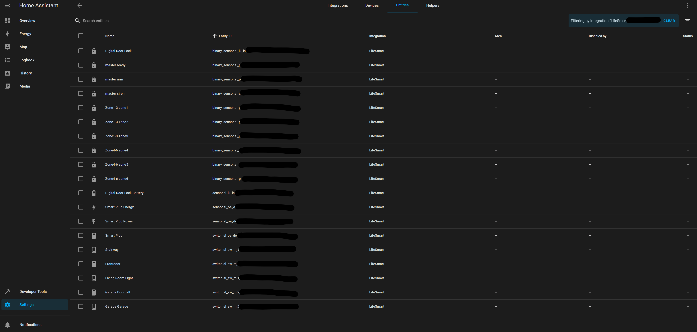

使用说明
====
让 Home Assistant 支持 Lifesmart 设备的 HACS 插件

### 准备步骤：
---
1. 请根据您所在的国家，确认您所在区域对应的 LifeSmart 服务器，默认建议使用 `api.cn0.ilifesmart.com`。[查看详细的区域服务器列表](./docs/api-regions.md)。

2. 在 LifeSmart 开放平台上创建一个新应用，以便获取应用密钥（`app key`）和应用令牌（`app token`）。[访问申请页面](http://www.ilifesmart.com/open/login)（注意：该链接不是 HTTS 连接，请检查浏览器地址栏是否使用 HTTP 访问）。

3. 使用您的 LifeSmart 账户登录上一步创建的应用，授权第三方应用访问，从而获取用户令牌（`user token`）。请确保您使用的 API 地址与您所在的区域相匹配。

**特别提示：LifeSmart 开放平台的默认应用不会包含锁设备的类型信息。如需此功能，需联系 LifeSmart 官方获取授权。**

### 插件如何运作：
---

- 该插件需要联网。在首次加载插件时，它会调用 LifeSmart API 来获取所有设备信息，并在 Home Assistant 中进行设置。之后，插件将通过 websocket 从 LifeSmart 获取设备更新信息。目前，Home Assistant 与 LifeSmart 集线器之间没有直接通信。

### 安装指南：
---

### 手动安装方法

不建议使用手动安装方法，因为它需要手动更新插件，且可能与最新的 Home Assistant 版本不兼容。

```yaml
lifesmart:
  appkey: # 你应用的 appkey
  apptoken: # 你应用的 apptoken
  usertoken: # 你获取到的 usertoken
  userid: # 你的的  userid
  url:  # 你使用的 api 地址，建议使用 api.cn0.ilifesmart.com
```

### 推荐使用 HACS 安装自定义仓库

1. 进入 HACS > 集成 > 点击右上角的三个点 > 选择自定义仓库。

2. 在自定义仓库对话框中输入以下信息：

仓库地址：`https://github.com/MapleEve/lifesmart-HACS-for-hass`

类别选择：`集成`

3. 点击添加按钮。

4. 通过添加集成进行设置。

使用 HACS 可以方便您在新版本发布后及时更新。

当插件足够稳定后，我将把它加入 HACS 默认仓库列表，并计划将来将其纳入 Home Assistant 官方集成。

示例配置：
---





支持的设备列表：
---
由于代码重构和更新，可能会有旧设备从支持列表中移除，移除的旧设备加上了~~删除线~~。
- 开关
- 智能门锁信息反馈
- 智能插座
- 动态传感器、门传感器、环境传感器、甲醛/气体传感器
- 照明：目前仅支持超级碗夜灯
- 通用遥控器
- 窗帘电机（目前仅支持 Duya 电机）
- 空调控制面板

支持设备详细列表

开关：
| 型号  | 备注 |
| ------ | ------ |
| OD_WE_OT1 |  |
| SL_MC_ND1 |  |
| SL_MC_ND2 |  |
| SL_MC_ND3 |  |
| SL_NATURE |  |
| SL_OL |  |
| SL_OL_3C |  |
| SL_OL_DE |  |
| SL_OL_UK |  |
| SL_OL_UL |  |
| SL_OL_W |  |
| SL_P_SW |  |
| SL_S |  |
| SL_SF_IF1 |  |
| SL_SF_IF2 |  |
| SL_SF_IF3 |  |
| SL_SF_RC |  |
| SL_SPWM |  |
| SL_SW_CP1 |  |
| SL_SW_CP2 |  |
| SL_SW_CP3 |  |
| SL_SW_DM1 |  |
| SL_SW_FE1 |  |
| SL_SW_FE2 |  |
| SL_SW_IF1 |  |
| SL_SW_IF2 |  |
| SL_SW_IF3 |  |
| SL_SW_MJ1 | 经过真实设备测试 |
| SL_SW_MJ2 | 经过真实设备测试 |
| SL_SW_MJ3 |  |
| SL_SW_ND1 |  |
| SL_SW_ND2 |  |
| SL_SW_ND3 |  |
| SL_SW_NS3 |  |
| SL_SW_RC |  |
| SL_SW_RC1 |  |
| SL_SW_RC2 |  |
| SL_SW_RC3 |  |
| SL_SW_NS1 |  |
| SL_SW_NS2 |  |
| SL_SW_NS3 |  |
| V_IND_S |  |

门锁：
| 型号  | 备注 |
| ------ | ------ |
| SL_LK_LS | 经过真实设备测试 |
| SL_LK_GTM |  |
| SL_LK_AG |  |
| SL_LK_SG |  |
| SL_LK_YL | 经过真实设备测试 |

通用控制器：
| 型号  | 备注 |
| ------ | ------ |
| SL_P | 经过真实设备测试 |

智能插座：
| 型号  | 备注 |
| ------ | ------ |
| SL_OE_DE | 支持计量，经过真实设备测试 |
| SL_OE_3C | 支持计量 |
| SL_OL_W | 支持计量 |
| OD_WE_OT1 |  |
| ~~SL_OL_UL~~ |  |
| ~~SL_OL_UK~~ |  |
| ~~SL_OL_THE~~ |  |
| ~~SL_OL_3C~~ |  |
| ~~SL_O~~L |  |

该项目是基于以下项目整合而来：
---
- [@skyzhishui 提供的 custom_components](https://github.com/skyzhishui/custom_components)
- [@Blankdlh 提供的 hass-lifesmart](https://github.com/Blankdlh/hass-lifesmart)
- [@likso 提供的 hass-lifesmart](https://github.com/likso/hass-lifesmart)
